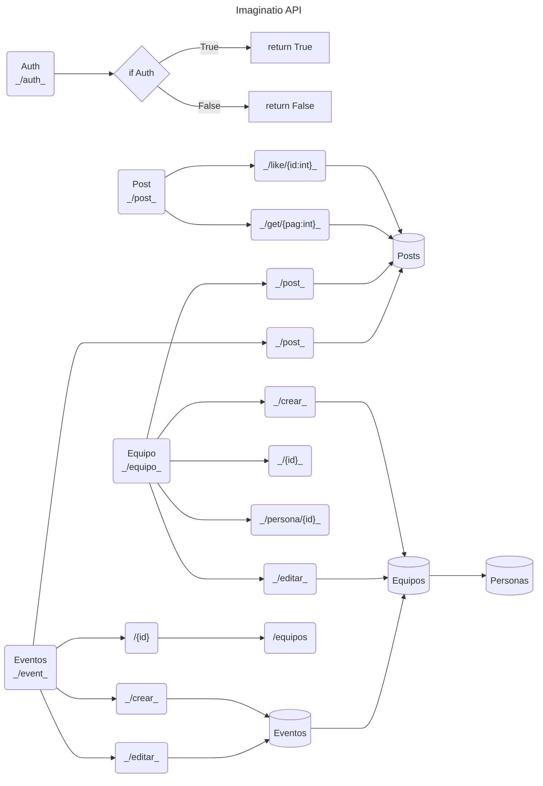

# Mapa de la API

```mermaid
---
title: Imaginatio API

---
flowchart LR    
    A("Auth
      _/auth_")
    
    A1{"if Auth"}
    A2["return True"]
    A3["return False"]

    A--->A1

    A1--True--->A2
    A1--False--->A3

    G("Post
    _/post_")

    G1("_/like/{id:int}_")
    G2("_/get/{pag:int}_")
    G3[("Posts")]

    G--->G1
    G--->G2

    G1--->G3
    G2--->G3

    J("Equipo
    _/equipo_")

    J4[("Equipos")]
    J5[("Personas")]

    J3("_/post_")
    J1("_/crear_")
    J2("_/editar_")
    J6("_/{id}_")
    J7("_/persona/{id}_")

    J--->J1
    J--->J2
    J--->J3
    J--->J6
    J--->J7
    J1--->J4
    J2--->J4

     E("Eventos
    _/event_")

    E1("_/crear_")
    E2("_/editar_")
    E3("_/post_")
    E5("/{id}")
    E6("/equipos")
    E4[("Eventos")]

    E--->E1
    E--->E2
    E1--->E4
    E2--->E4
    E--->E3
    E--->E5
    E5--->E6

    J3--->G3
    E3--->G3
    J4--->J5
    E4--->J4
```