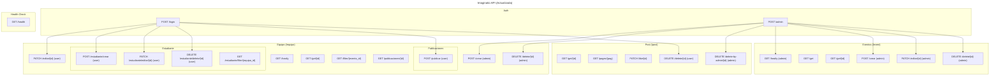

# Mapa de la API

```mermaid
---
title: Imaginatio API (Actualizada)
---
flowchart TD
    subgraph "Auth"
        direction LR
        A1["POST /login"]
        A2["POST /admin"]
    end

    subgraph "Post (/post)"
        direction TB
        P1["GET /get/{id}"]
        P2["GET /pages/{pag}"]
        P3["PATCH /like/{id}"]
        P4["DELETE /delete/{id} (user)"]
        P5["DELETE /delete-by-admin/{id} (admin)"]
    end

    subgraph "Equipo (/equipo)"
        direction TB
        E1["GET /healty"]
        E2["POST /crear (admin)"]
        E3["PATCH /editar/{id} (user)"]
        E4["DELETE /delete/{id} (admin)"]
        E5["GET /get/{id}"]
        E6["GET /filter/{evento_id}"]
        E7["GET /publicaciones/{id}"]
        
        subgraph "Estudiante"
            direction TB
            ES1["POST /estudiante/crear (user)"]
            ES2["PATCH /estudiante/editar/{id} (user)"]
            ES3["DELETE /estudiante/delete/{id} (user)"]
            ES4["GET /estudiante/filter/{equipo_id}"]
        end

        subgraph "Publicaciones"
            direction TB
            EP1["POST /publicar (user)"]
        end
    end

    subgraph "Eventos (/event)"
        direction TB
        V1["GET /healty (admin)"]
        V2["GET /get"]
        V3["GET /get/{id}"]
        V4["POST /crear (admin)"]
        V5["PATCH /editar/{id} (admin)"]
        V6["DELETE /delete/{id} (admin)"]
    end

    subgraph "Health Check"
        H1["GET /health"]
    end

    A1 --> E3
    A1 --> ES1
    A1 --> ES2
    A1 --> ES3
    A1 --> EP1
    A1 --> P4

    A2 --> E2
    A2 --> E4
    A2 --> P5
    A2 --> V1
    A2 --> V4
    A2 --> V5
    A2 --> V6
```
