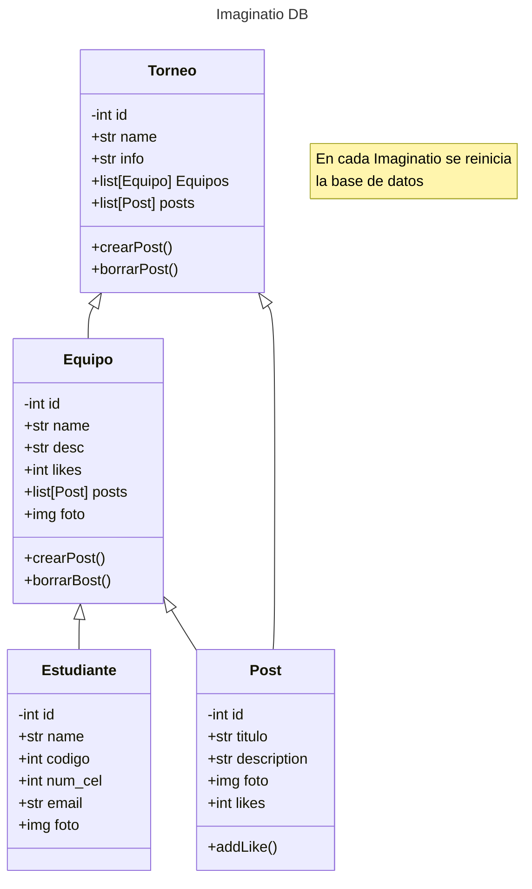

# Diagrama de la Base de Datos

```mermaid
---
title: Imaginatio DB
---
classDiagram
    class Torneo{
        -int id
        +str name
        +str info
        +list[Equipo] Equipos
        +list[Post] posts
        +crearPost()
        +borrarPost()
    }
    class Equipo{
        -int id
        +str name
        +str desc
        +int likes
        +list[Post] posts
        +img foto
        +crearPost()
        +borrarBost()
    }
    class Estudiante{
        -int id
        +str name
        +int codigo
        +int num_cel
        +str email
        +img foto
    }
    class Post{
        -int id
        +str titulo
        +str description
        +img foto
        +int likes
        +addLike()
    }
    Equipo <|-- Estudiante
    Equipo <|-- Post
    Torneo <|-- Equipo
    Torneo <|-- Post
    note "En cada Imaginatio se reinicia <br> la base de datos"
```