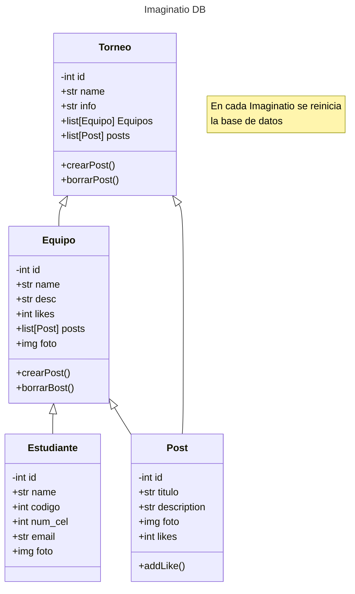

# Diagrama de la Base de Datos

Este corresponde al diagrama de clases pensado para el proyecto



Este es el codigo utilizando DBML en [DBdiagram.io](https://dbdiagram.io/d)

```sql
Table Equipos {
  equipo_id integer [primary key, unique]
  name varchar(30)
  desc text
  likes integer
  evento_id integer
}

Table Estudiante {
  est_id integer [primary key, unique]
  name varchar(30)
  codigo varchar(8)
  img image
  phone varchar(20)
  email varchar(40)
  instagram varchar(10)
  twiter varchar(10)
  tiktok varchar(10)
  equipo_id integer
}

Table Eventos {
  event_id integer [primary key, unique]
  name varchar(30)
  desc text
}

Table Post {
  post_id integer [primary key, unique]
  titulo varchar(30)
  desc text
  img image
  equipo_id integer
  likes integer
}

Ref: Estudiante.equipo_id > Equipos.equipo_id
Ref: Equipos.evento_id > Eventos.event_id
Ref: Post.equipo_id > Equipos.equipo_id
```
