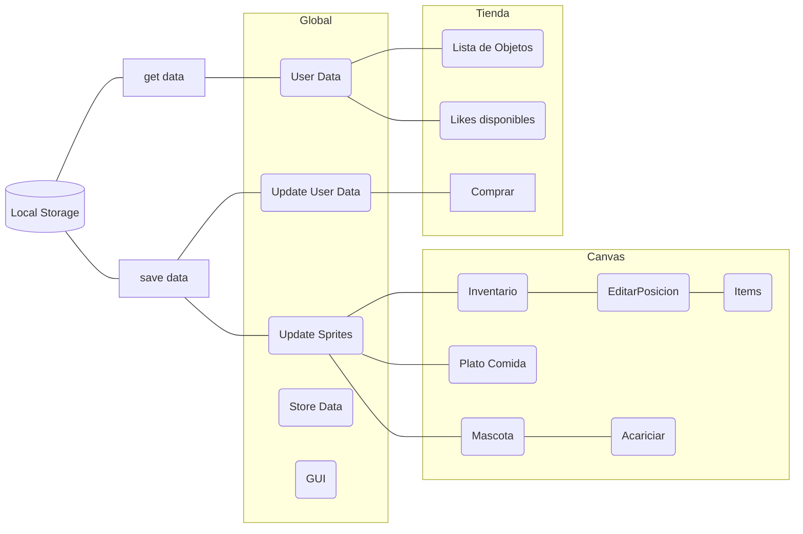
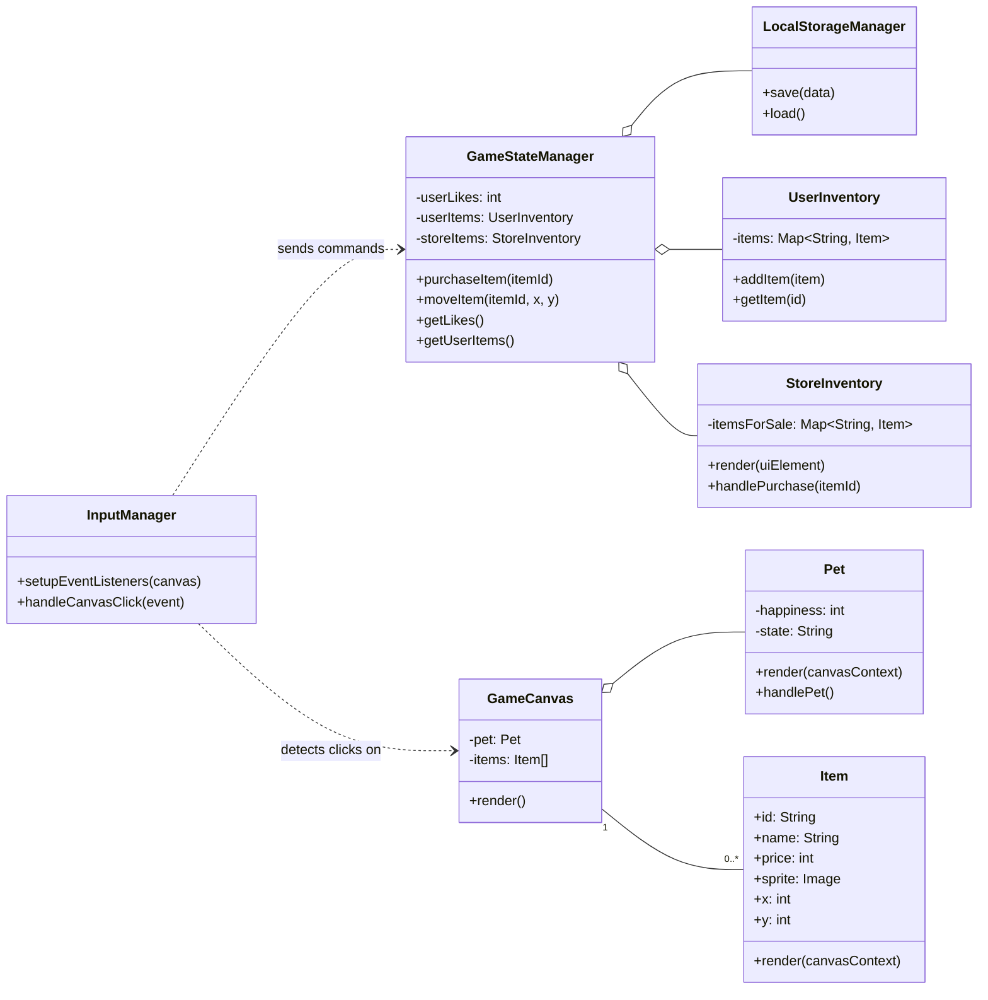

# Construcción del funcionamiento de la Mascota

La mascota tiene un estilo **Tamagochi,** donde el usuario puede decorar el espacio con diferentes elementos estéticos, los cuales puede adquirir en una tienda teniendo como moneda de cambio los **Likes** que ha dado a las publicaciones. Se debe de cumplir los siguientes requisitos

* Acariciar a la mascota.
* La tienda debe identificar que items que ya compró el usuario.
* El usuario puede modificar la ubicación de los items.

## Diagrama de Flujo

## Diagrama de Clases

