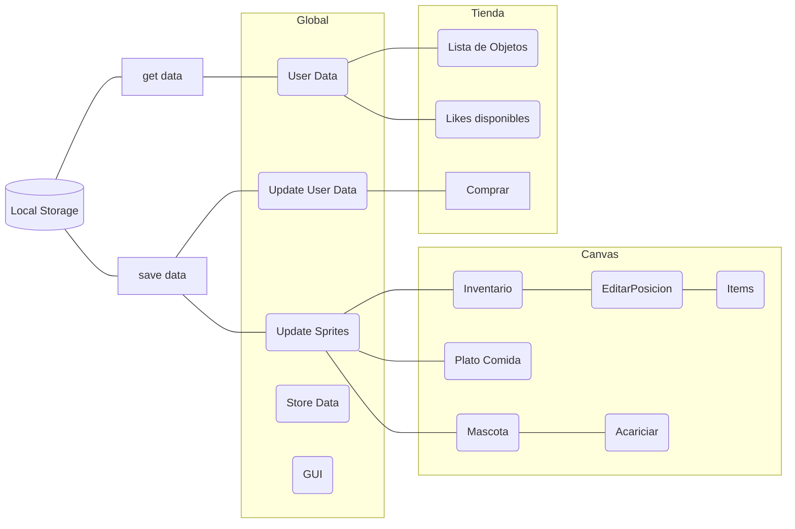
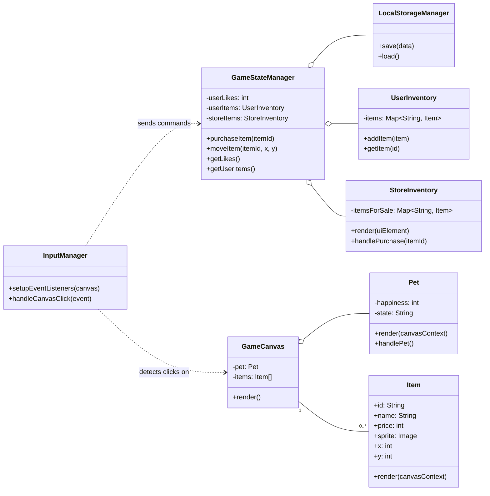

# Construcción del funcionamiento de la Mascota

La mascota tiene un estilo **Tamagochi,** donde el usuario puede decorar el espacio con diferentes elementos estéticos, los cuales puede adquirir en una tienda teniendo como moneda de cambio los **Likes** que ha dado a las publicaciones. Se debe de cumplir los siguientes requisitos

* Acariciar a la mascota: El usuario debe poder acariciar a la mascota manteniendo presionado sobre ella y moviendo el cursor/dedo verticalmente.
* La tienda debe identificar que items que ya compró el usuario.
* El usuario puede modificar la ubicación de los items.
* Soporte Táctil: Todas las interacciones (acariciar, mover objetos) deben ser compatibles con pantallas táctiles para su uso en dispositivos móviles.

## Diagrama de Flujo

## Diagrama de Clases

## Implementación de Animaciones de la Mascota

La animación de la mascota se controla mediante una **máquina de estados**. La clase `Pet` tiene una propiedad `this.state` que puede tener dos valores: `'idle'` (inactivo) o `'petting'` (siendo acariciado). La animación que se muestra en pantalla depende directamente de este estado.

Así es como las diferentes partes de la clase `Pet` trabajan en conjunto:

### 1. Carga de Sprites (`loadSprites`)

Este método se llama en el constructor para cargar todas las imágenes necesarias desde sus respectivas carpetas al inicio del juego.

*   **Animación "Idle"**: Carga cada cuadro de la animación (ej. `idle0000.png`) en el array `this.idleFrames`.
*   **Animación "Petting"**: Carga la única imagen para esta acción en la propiedad `this.pettingSprite`.

### 2. Cambio de Estado (`handlePet`)

Cuando el usuario acaricia a la mascota, este método cambia el estado a `this.state = 'petting'`. Esto dispara el cambio de animación. Usa `setTimeout` para volver automáticamente al estado `'idle'` después de un breve período.

### 3. Actualización de la Animación (`update`)

Este método se debe llamar en cada fotograma del bucle del juego. Es responsable de avanzar los cuadros de la animación "idle".

*   Comprueba si `this.state === 'idle'`.
*   Si es así, usa un contador para ciclar lentamente a través de las imágenes en el array `this.idleFrames`, creando el efecto de una animación en bucle.

### 4. Dibujo del Sprite Correcto (`render`)

Este método también se llama en cada fotograma. Comprueba el estado actual y dibuja la imagen correspondiente.

*   Si el estado es `'petting'`, dibuja `this.pettingSprite`.
*   Si el estado es `'idle'`, dibuja el cuadro de animación actual desde el array `this.idleFrames`.
