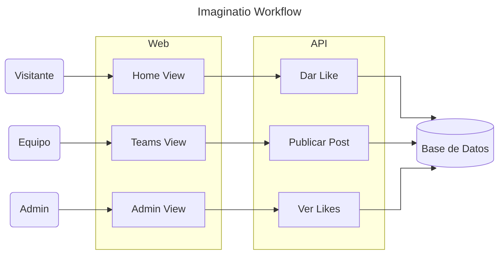
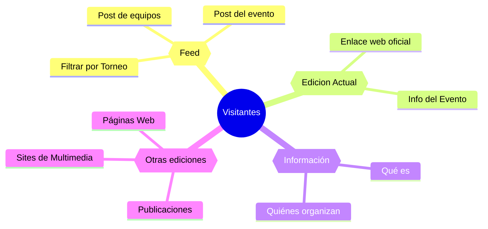
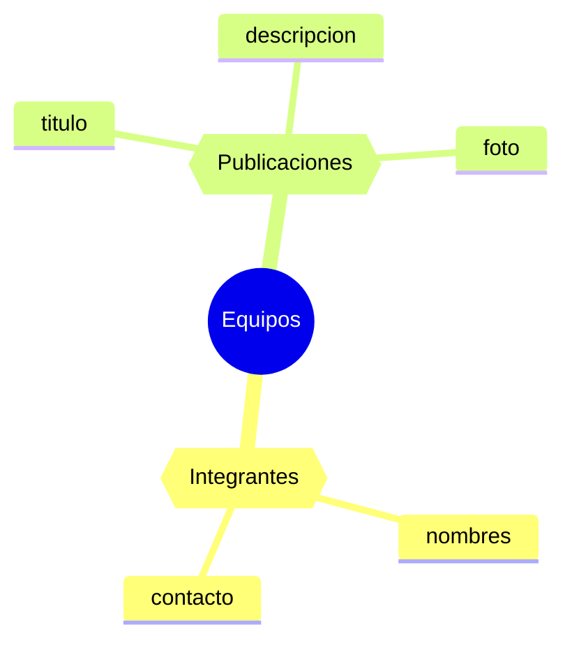
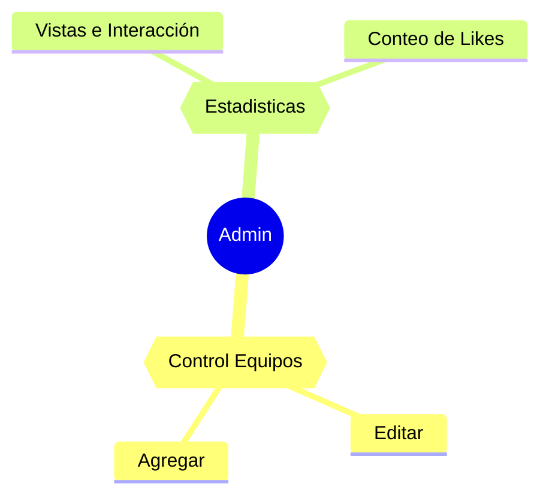

# Diagrama de Requisitos de la APP

## General

Descripción básica del funcionamiento  esperado del sitio web del **Imaginatio.**

## Visitantes

Mapa mental de lo que necesitan ver los visitantes e interesados en el Imaginatio

## Equipos

Mapa mental de lo que necesitan los equipos que participen en el Imaginatio

## Admin

Mapa mental de lo necesario para la vista Admin

