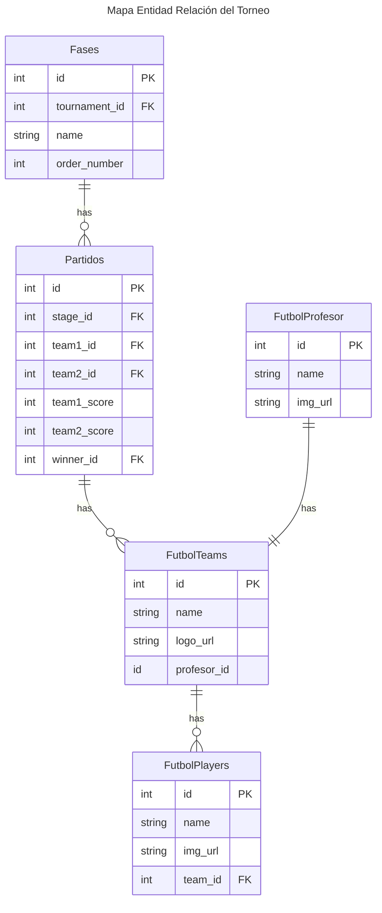
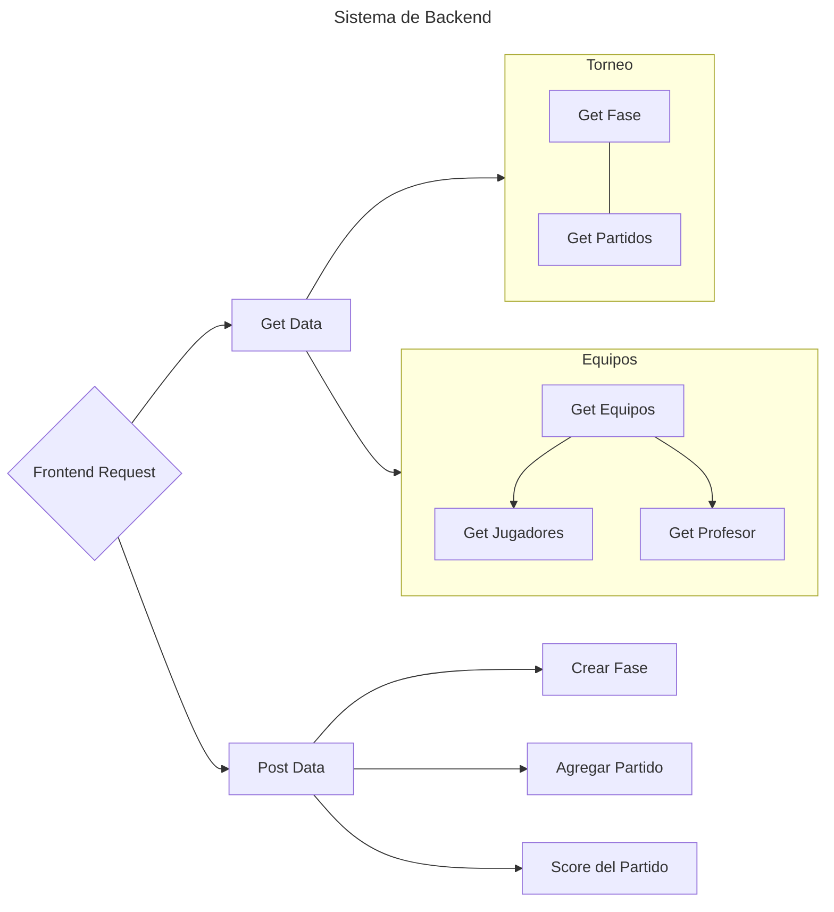

# TORNEO DE FUTBOL

Se quiere realizar un torneo de futbol 5 con selecciónes, donde los estudiantes se inscriben en grupos de a 6, y se les asignará un país para representar y un profesor que será anónimo hasta el día del evento.

## Diagrama Entidad Relación

## Diagrama de flujo del Backend

